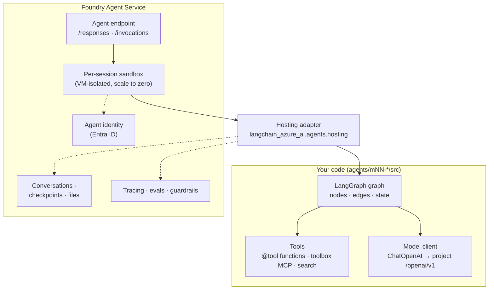

# Concepts: the thread through every lab

Each lab adds **one capability** to the same idea: *a LangGraph agent that Foundry hosts for you*.
Keep this picture in mind.

## 1. The graph is the agent

A **LangGraph graph** is a state machine: *nodes* are Python functions (call a model, run tools, route,
ask a human), *edges* decide what runs next, and *state* (usually a `messages` list) flows through it.

- `create_agent(model, tools)` gives you a ready-made **ReAct** graph (M2).
- `StateGraph` lets you build any control flow yourself: loops, routers, parallel branches, human approval
  (M3, M7, M13).

## 2. The model client is always the same

Every lab uses one factory: LangChain `ChatOpenAI` pointed at your project's **OpenAI-compatible
`/openai/v1` endpoint**, authenticated with an **Entra ID token** (no keys), using the **Responses API**.
Switch models by changing a deployment name (M1, M14).

## 3. Hosting turns a graph into a service

The `langchain_azure_ai.agents.hosting` adapter wraps a compiled graph in a small web server that speaks
Foundry's protocols:

| Protocol | Endpoint | Use it for |
|---|---|---|
| **Responses** | `POST /responses` | Chat-style agents: OpenAI-compatible, streaming, `previous_response_id`, conversations, tool/approval items |
| **Invocations** | `POST /invocations` | Custom JSON in/out, webhooks, non-chat jobs; session via `agent_session_id` |

`langgraph.json` tells the adapter *which* graph to serve. `azd` packages the folder and Foundry runs it
as a **hosted agent version** (M2).

## 4. Foundry supplies the enterprise plumbing

| Concern | Foundry feature | Lab |
|---|---|---|
| Identity | Each hosted agent gets its **own Entra ID identity**. Grant it roles like any app. | M2, M4 |
| Tools | **Toolbox**: web search, code interpreter, MCP servers behind one authenticated MCP endpoint | M5, M8 |
| Knowledge | **Azure AI Search** index queried by a tool | M4 |
| State | Responses **conversations**, `FoundryCheckpointSaver`, **Memory** stores | M6, M13 |
| Quality | **Evaluations** against the deployed agent | M9, M15 |
| Visibility | **OpenTelemetry GenAI traces** in Application Insights | M10 |
| Safety | **RAI policies** (content filters, prompt shields) + red teaming | M11, M12 |
| Cost/quality | **Fine-tuning / distillation** of a cheaper model | M14 |

## 5. The lab loop

Every lab repeats the same five steps. The helper `workshop/azd.py` prints the exact `azd` command for
each one, so you can re-run it by hand in a terminal:

1. **Write** the graph in `agents/mNN-*/src/<agent>/main.py`.
2. **Init**: `azd ai agent init -m azure.yaml --project-id … --model-deployment …`
3. **Run locally**: `azd ai agent run` → `POST http://localhost:<port>/responses`
4. **Deploy**: `azd deploy` → a new **agent version** is created and activated
5. **Invoke**: `project.get_openai_client(agent_name=…).responses.create(...)` or `azd ai agent invoke`

## Glossary

| Term | Meaning |
|---|---|
| **Foundry project** | Workspace holding models, agents, connections, evaluations. Endpoint `https://<account>.services.ai.azure.com/api/projects/<project>` |
| **Deployment** | A model made callable under a name (e.g. `gpt-5.4-mini`) |
| **Hosted agent** | Your containerized code run by Foundry Agent Service. Versioned; each version is immutable |
| **Session** | A sandbox bound to a conversation. Scales to zero after the idle timeout and resumes with its `$HOME` restored |
| **Toolbox** | A versioned bundle of tools exposed through one MCP endpoint |
| **Checkpointer** | LangGraph's persistence for graph state (needed for `interrupt()` and durable multi-turn) |
| **RAI policy** | A named set of content filters/prompt shields applied to model or agent traffic |
