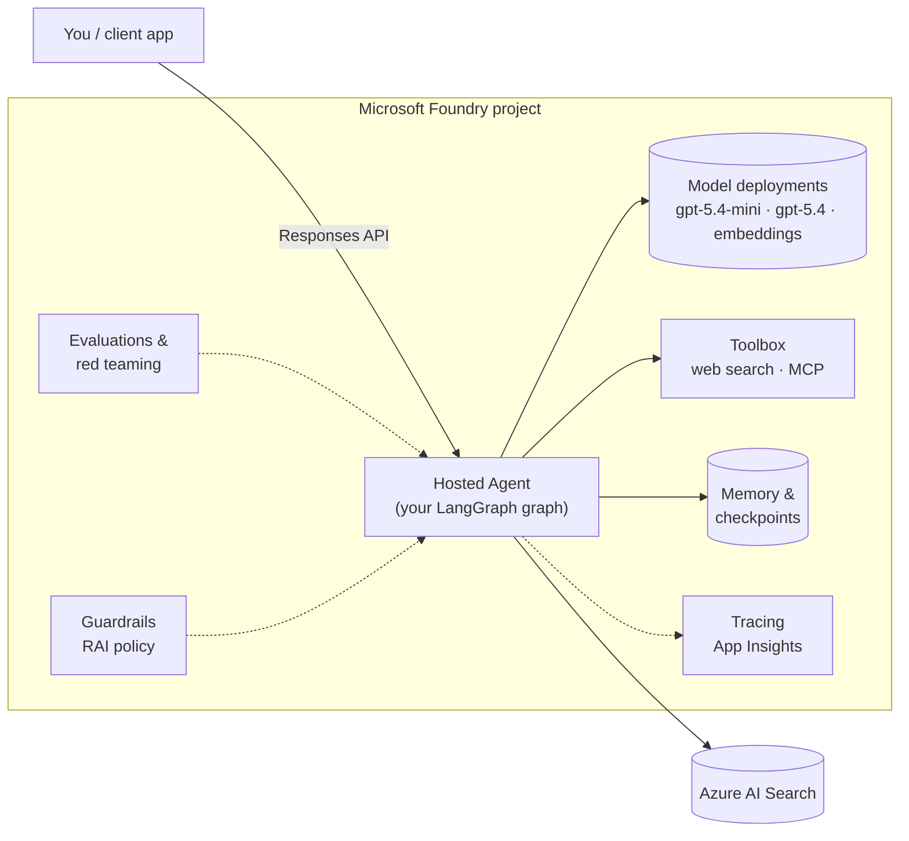

# Microsoft Foundry: LangGraph Hosted Agents Workshop

> A **hands-on coding workshop** for AI engineers: build agents with **LangGraph** and run them as
> **Microsoft Foundry Hosted Agents**, from your first model call to a grounded, tool-using, evaluated,
> observable, guarded agent that asks a human before acting.

Each lab is a Jupyter notebook that also renders as a page on this site, so you can read along or run it
against your own Foundry project. **Every lab has been run end-to-end against a live Foundry
project** (see the [validation report](validation.md)). The outputs you see are real.

!!! success "One script, one project, `az login`, and you're off"
    [Setup](setup.md) installs the tools and provisions **everything** in your lab subscription with one
    command: Foundry project, models, AI Search, App Insights, a guardrail policy and role assignments.
    You make no design decisions before the first lab.

---

## What you will build

You write the **agent logic in LangGraph**. **Foundry** runs it: packaging, a per-session sandbox,
identity, scale-to-zero, conversation storage, tracing, evaluation and the public endpoint.

---

## Read the platform primer first

Four short pages give you the mental model before lab 1:

| Page | You'll learn |
|---|---|
| [Hosted agents](platform/01-hosted-agents.md) | What a hosted agent is, sessions and sandboxes, protocols |
| [LangGraph on Foundry](platform/02-langgraph-on-foundry.md) | How a compiled graph becomes a `/responses` endpoint |
| [azd lifecycle, identity & RBAC](platform/03-azd-lifecycle-identity-rbac.md) | `init → run → deploy → invoke`, who calls what with which identity |
| [Toolbox & MCP](platform/04-toolbox-and-mcp.md) | Foundry-managed tools behind one MCP endpoint |

---

## The labs

| # | Lab | You build |
|---|---|---|
| M0 | [Preflight](modules/00-preflight.ipynb) | Verify tools, login, roles, models |
| M1 | [First inference](modules/01-first-inference.ipynb) | LangChain `ChatOpenAI` on Foundry, streaming, structured output |
| M2 | [First hosted agent](modules/02-first-hosted-agent.ipynb) | `create_agent` → `azd ai agent run` → `azd deploy` → invoke |
| M3 | [Tools & function calling](modules/03-tools-and-function-calling.ipynb) | Hand-built ReAct `StateGraph` with `ToolNode` |
| M4 | [Grounding / RAG](modules/04-grounding-rag.ipynb) | Azure AI Search hybrid retrieval tool with citations |
| M5 | [MCP via Foundry Toolbox](modules/05-toolbox-mcp.ipynb) | Web search + Microsoft Learn MCP through a toolbox |
| M6 | [Agent memory](modules/06-agent-memory.ipynb) | Conversations, durable checkpoints, long-term memory |
| M7 | [Multi-agent orchestration](modules/07-multi-agent.ipynb) | Pipelines, supervisor routing, fan-out/fan-in |
| M8 | [Deep research](modules/08-deep-research.ipynb) | Deep Agents: planning, sub-agents, web research |
| M9 | [Evaluation](modules/09-evaluation.ipynb) | Local evaluators + cloud evaluation of the hosted agent |
| M10 | [Observability & tracing](modules/10-observability.ipynb) | OpenTelemetry GenAI spans in App Insights |
| M11 | [Guardrails](modules/11-guardrails.ipynb) | RAI policy on the agent + in-graph input screening |
| M12 | [Red teaming](modules/12-red-teaming.ipynb) | AI Red Teaming Agent scan of your hosted agent |
| M13 | [Human-in-the-loop & REST](modules/13-hitl-and-rest.ipynb) | `interrupt()` approvals, raw REST + streaming |
| M14 | [Fine-tuning & distillation](modules/14-fine-tuning.ipynb) | Distill gpt-5.4 → gpt-4.1-mini and swap it into the agent |
| M15 | [Capstone](modules/15-capstone.ipynb) | Everything together, behind an evaluation gate |

---

## Suggested agenda

This is a comfortable **two-day** workshop. For a single long day, treat M8, M12 and M14 as "read & skim".

| Block | Modules |
|---|---|
| **Before day 1** (30 min, at home) | [Setup](setup.md) · M0 |
| **Day 1 AM**: Foundations | Platform primer · M1 · M2 · M3 |
| **Day 1 PM**: Knowledge & tools | M4 · M5 · M6 · M7 |
| **Day 2 AM**: Quality & safety | M14 *(submit the fine-tune job first!)* · M8 · M9 · M10 · M11 |
| **Day 2 PM**: Hardening & capstone | M12 · M13 · M14 *(finish)* · M15 |

!!! tip "Fine-tuning takes time"
    A fine-tuning job runs 30–120 minutes. Start **M14 §1–3** at the beginning of Day 2 so the job trains
    while you work through the other labs.

---

## How to use this site

1. **Do [Setup](setup.md) first**: ~30 minutes, *before* the workshop.
2. **Read the [Concepts](concepts.md)** for the thread that ties the labs together.
3. **Work the labs in order.** Each ends with a **🧪 Your turn** exercise.

Ready? → **[Set up your lab machine](setup.md)**
