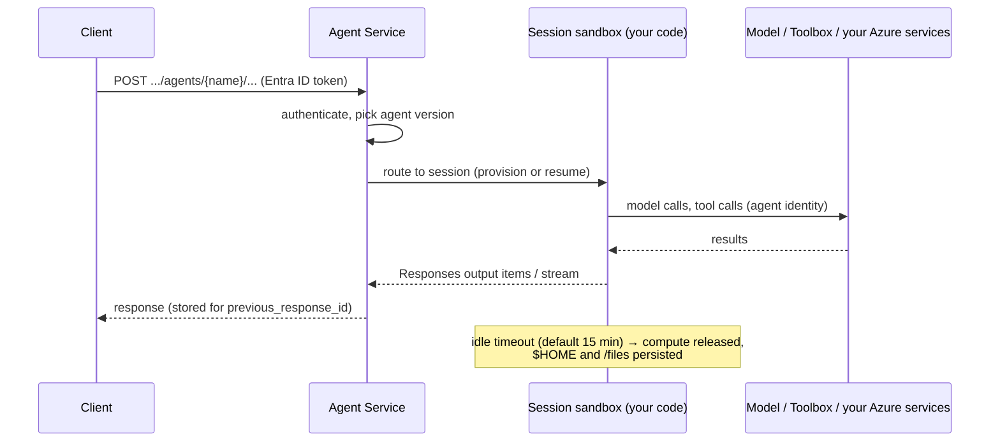

# Hosted agents

**Hosted agents** let you run agents written in *any* framework (LangGraph, Microsoft Agent Framework,
your own code) inside **Foundry Agent Service**. You bring the code; Foundry handles containerization,
the web endpoint, identity, scaling, session state, observability and versioning.

!!! info "Prompt agents vs hosted agents"
    | | Prompt agent | **Hosted agent** (this workshop) |
    |---|---|---|
    | You provide | Model + instructions + declarative tools | **Your code** (a LangGraph graph) |
    | Control flow | Foundry's built-in loop | **Anything you can code**: routers, parallel branches, interrupts |
    | Runs where | Foundry service | A **per-session sandbox** in Foundry |
    | Deploy with | Portal / SDK | `azd deploy`, VS Code Foundry Toolkit, SDK or REST |

## Architecture

### Sessions and sandboxes

- Each **session** runs in its own **VM-isolated sandbox** with a persistent `$HOME` and `/files`.
- Compute follows the *session*: it is provisioned on first use and released after the **idle timeout**
  (2–60 min, default 15). The session's files are restored when it resumes; sessions are deleted after
  30 days of inactivity.
- CPU and memory in `azure.yaml` (`container.resources`) apply **per session**. Billing is CPU+memory
  across active sessions, so size small (the labs use `0.5` vCPU / `1Gi`).
- The first call to a new version or session is a **cold start** (a few seconds).

### Protocols

| Protocol | Path on the agent endpoint | Notes |
|---|---|---|
| Responses | `/responses` | OpenAI-compatible; streaming; server-side history; approval items |
| Invocations | `/invocations` | Your own JSON contract; session via `agent_session_id` |
| Invocations (WebSocket) | WebSocket variant | Long-lived, bidirectional |
| A2A | `/protocols/a2a` | Agent-to-agent (see M7 stretch) |

### Versions

`azd deploy` creates a new **immutable agent version** each time and routes traffic to it. Roll back by
redeploying an older definition. The agent **name** is stable, and clients always call the name.

### Runtime environment variables

Foundry injects these into your code at runtime:

| Variable | Value |
|---|---|
| `FOUNDRY_PROJECT_ENDPOINT` | Your project endpoint |
| `APPLICATIONINSIGHTS_CONNECTION_STRING` | The project's App Insights (tracing) |
| Anything in `azure.yaml → env` | e.g. `AZURE_AI_MODEL_DEPLOYMENT_NAME`, `TOOLBOX_NAME` |

!!! warning "Reserved names"
    Don't define your own variables starting with `FOUNDRY_`; that prefix is reserved for the runtime.

### Regions

Hosted agents are available in most major regions (East US, East US 2, West US, West US 3, Sweden Central,
UK South, …). The workshop provisions in **East US 2** by default.

➡️ Next: [LangGraph on Foundry](02-langgraph-on-foundry.md)
