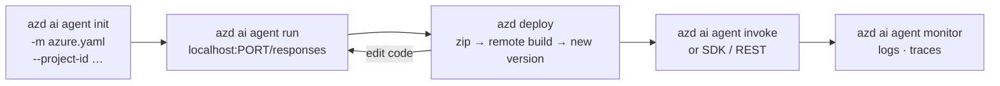

# azd lifecycle, identity & RBAC

## The lifecycle



| Step | Command | What happens |
|---|---|---|
| **Init** | `azd ai agent init --no-prompt -m agents/mNN/azure.yaml --project-id <ARM id> --model-deployment gpt-5.4-mini -e <env>` | Creates an azd project folder, adopts the manifest, links it to your **existing** Foundry project, writes `.azure/<env>/.env` |
| **Run** | `azd ai agent run --no-client --port 81NN` | Creates a local venv, installs `requirements.txt`, starts `startupCommand` |
| **Deploy** | `azd deploy` | **Code deploy**: zips `src/<agent>` (honouring `.agentignore`), uploads it, Foundry installs dependencies (remote build), creates a new **agent version**, waits until `active` (~2 min) |
| **Invoke** | `azd ai agent invoke <name> "hi"` | Calls the deployed agent; sessions reused automatically |
| **Show / monitor** | `azd ai agent show`, `azd ai agent monitor` | Status, endpoints, live container logs |
| **Env** | `azd env set KEY VALUE` | Values referenced as `${KEY}` in `azure.yaml → env` |

In the notebooks, `workshop.azd.init_agent("mNN-…")` does *init* for you and returns an object with
`.run_local()`, `.deploy()`, `.invoke()`, `.monitor()`, and each call prints the underlying `azd` command.

!!! tip "No Docker required"
    The labs use **code deploy** (`codeConfiguration`): Foundry builds your dependencies in the cloud.
    Docker is only needed if you switch a service to **container** deploy (`--deploy-mode container`).

!!! warning "`.agentignore` matters"
    `azd ai agent run` creates a `.venv` *inside* `src/<agent>`. Every lab ships an `.agentignore`
    that excludes it. Without one, `azd deploy` would try to upload hundreds of MB.

## Identities: who calls what

| Caller | Identity | Needs |
|---|---|---|
| **You** (notebook, azd, local agent) | Your `az login` user via `DefaultAzureCredential` | **Foundry User** (call models/agents), **Foundry Project Manager** (deploy agents), plus data roles on Search etc. |
| **Hosted agent** (running in Foundry) | A **dedicated Entra agent identity** created at deploy time | Model inference in its project works by default. Anything else (AI Search, Storage, …) needs an explicit role assignment. |
| **Foundry project** | Project managed identity | Used by connections/toolboxes (e.g. AAD search connection) |

`scripts/provision.ps1` assigns your user all roles the labs need. Labs that call external resources
from the hosted agent (M4 AI Search) grant the **agent identity** its role in a notebook cell.

!!! note "Renamed roles"
    *Foundry User / Foundry Owner / Foundry Project Manager* were previously named *Azure AI User /
    Azure AI Owner / Azure AI Project Manager*. The role IDs are unchanged.

## azd authentication

The workshop configures azd to reuse your Azure CLI login, so you only sign in once:

```bash
az login
azd config set auth.useAzCliAuth true
azd auth login --check-status
```

➡️ Next: [Toolbox & MCP](04-toolbox-and-mcp.md)
