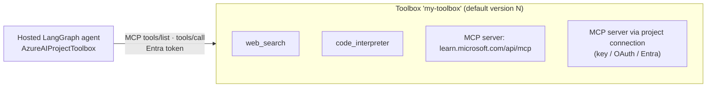

# Toolbox & MCP

A **toolbox** is a versioned bundle of tools in your Foundry project, exposed to agents through **one
Model Context Protocol (MCP) endpoint**. Instead of wiring each tool's SDK, credentials and schemas into
your code, your hosted agent loads *whatever the toolbox contains* at startup.



## Why use a toolbox

- **One endpoint, many tools**: `…/toolboxes/<name>/mcp?api-version=v1`
- **Versioned**: create a new version, test it on its version-specific endpoint, then *promote* it to
  default. Agents on the consumer endpoint pick it up **without redeploying**.
- **Credentials stay in Foundry**: downstream keys/OAuth live on **project connections**, never in agent code.
- **Governance**: guardrail (RAI) policies can be attached to a toolbox.

## Create a toolbox (Python SDK)

```python
from azure.ai.projects.models import MCPToolboxTool, WebSearchToolboxTool

project.toolboxes.create_version(
    name="lgws-m05-toolbox",
    description="Web search + Microsoft Learn MCP",
    tools=[
        WebSearchToolboxTool(name="web_search"),
        MCPToolboxTool(server_label="mslearn",
                       server_url="https://learn.microsoft.com/api/mcp",
                       require_approval="never"),
    ],
)
```

## Use it from LangGraph

```python
from langchain_azure_ai.tools import AzureAIProjectToolbox

async def create_graph():
    tools = await AzureAIProjectToolbox(toolbox_name=os.environ["TOOLBOX_NAME"]).get_tools()
    return create_agent(_build_chat_model(), tools=tools)
```

`langgraph.json` points at `./main.py:create_graph`; the host awaits the factory once at startup.

## Tool approval

Each tool advertises `require_approval` (`always` / `never`). **The toolbox does not enforce it. Your
runtime must.** Either keep `never` for read-only tools, or pause the graph with `interrupt()` before
calling an `always` tool (see M13).

## Also available

`azd` can declare toolboxes next to your agent in `azure.yaml` (`host: azure.ai.toolbox`) and manage them
with `azd ai toolbox …`. The labs create toolboxes from the notebook so you can see each step.

➡️ Start the labs: [M0 · Preflight](../modules/00-preflight.ipynb)
